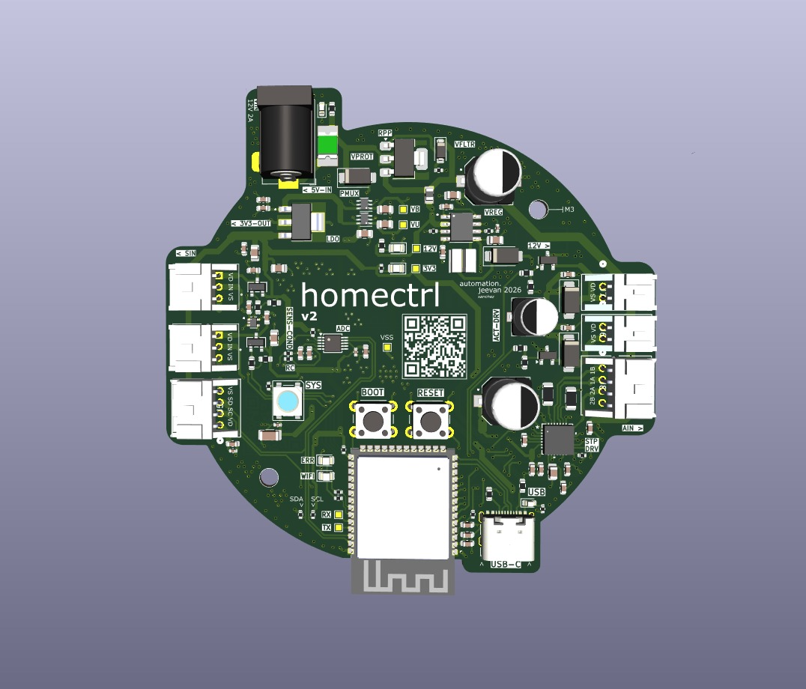
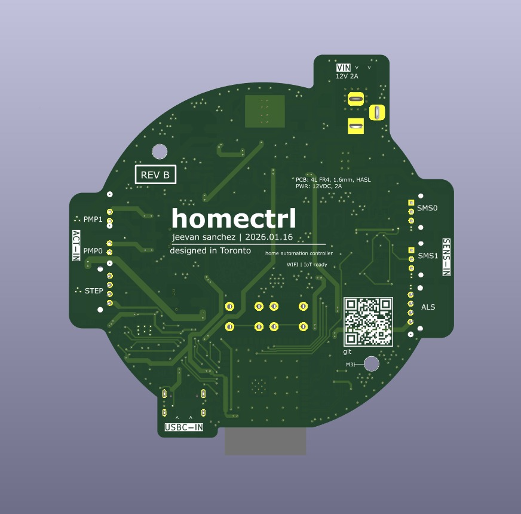
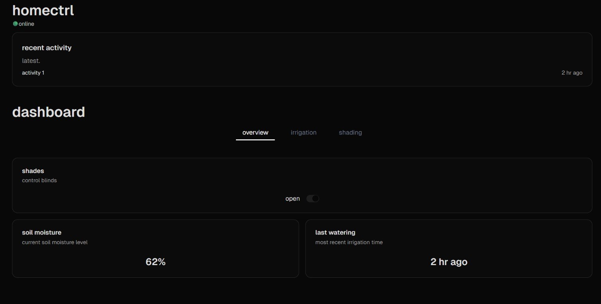

# homectrl
> Smart home automation controller designed in KiCad; dashboard built with Next.js, firmware in Arduino C/C++.

**Huge thanks to PCBWay for sponsoring this project's first revision.**<br>
[Check out **REV A**](https://github.com/jeevan9s/homectrl-sys/tree/rev-A)

<hr>

**REV B Updates**: 
* The board is currently being fabbed!
* Main controller has a tighter layout, with an SMD-first layout, and mixed-signal design (4L). 
* Designed a standalone [ALS](https://github.com/jeevan9s/homectrl-sys/tree/rev-B/hardware/lux-module) (Ambient-Light-Sensor) breakout module for further automation capability.
* All IC breakout circuitry was custom desgined, no breakout-boards were used. 
* Onboard ADC, and motor control (MOSFET, Stepper Driver) were implemented. 

<details>
<summary>Contents</summary>

- [overview](#overview)
- [architecture](#architecture)
  - [firmware](#firmware)
  - [hardware](#hardware)
- [prerequisites / installation](#prerequisites--installation)
- [acknowledgements](#acknowledgements)
- [contact](#contact)

</details>

# Overview
<table width="100%" cellspacing="0" cellpadding="5">
  <tr>
    <td align="center" width="50%">
      
    </td>
    <td align="center" width="50%">
      
    </td>
  </tr>
</table>

<table width="100%" cellspacing="0" cellpadding="5">
    <tr>
    <td align="center" width="100%">
      
    </td>
  </tr>
</table>


I built **homectrl** to modularize and automate my first apartment.


## Built With
- **KiCad**
- 
- 
- 
- 


# Architecture
## System
> More info coming soon, after midterm season :)

### Prerequisites
- <b>Software:</b> Arduino IDE (with Espressif ESP32 board support)
- <b>Libraries:</b> PubSubClient, SinricPro, WebSockets, and any other dependencies listed in firmware
- <b>Node.js:</b> v18+ (for Next.js dashboard)
- <b>Package Manager:</b> npm or yarn

### Installation
1. Clone the repository:
```bash
git clone https://github.com/jeevan9s/homectrl.git
cd homectrl
```

## Acknowledgements
Thanks again to **[PCBWay]([url](https://www.pcbway.com/))** for supporting this project.  
Their workflow and quality made prototyping straightforward and reliable, and I’ll definitely be using their service for future PCB projects.

<!-- 
<table width="100%" cellspacing="0" cellpadding="5">
  <tr>
    <td align="center" width="50%">
      
    </td>
    <td align="center" width="50%">
      
    </td>
  </tr>
</table> -->

## Contact 
[`email`](mailto:jeevansanchez42@gmail.com)&nbsp;&nbsp;&nbsp; [``LinkedIn``](https://linkedin.com/in/jeevansanchez)


