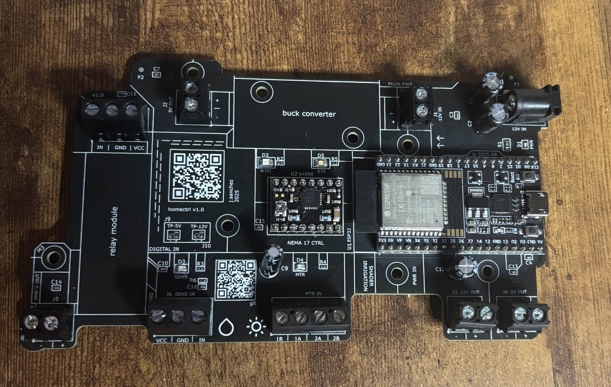
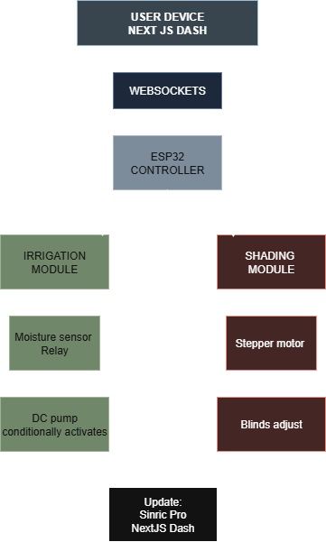
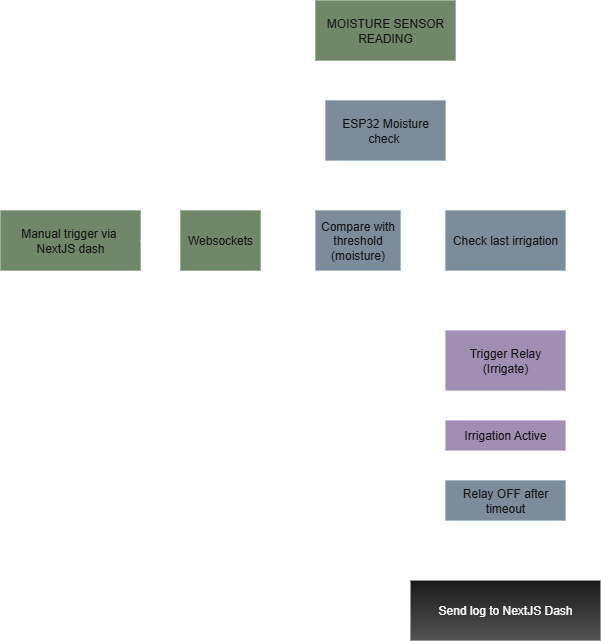
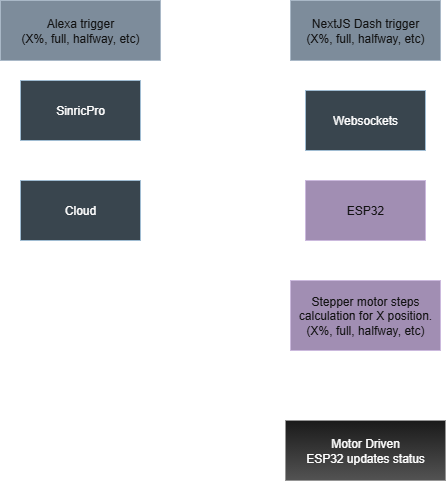
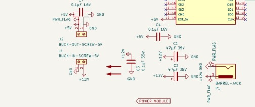
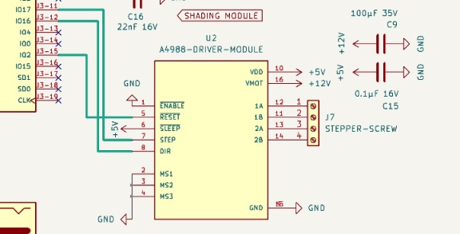
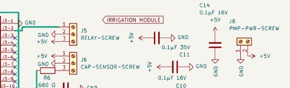
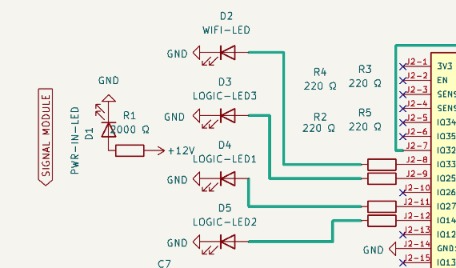

# homectrl
> Smart home automation controller designed in KiCad; dashboard built with Next.js, firmware in Arduino C/C++.

**Huge thanks to PCBWay for sponsoring this project.**<br>
The prototyping experience was smooth with great service and communication; looking forward to more projects with their service!

<hr>

**REV B arriving January 2026**: tighter layout, SMD-first design, and more features/integration.<br>

<details>
<summary>Contents</summary>

- [overview](#overview)
- [architecture](#architecture)
  - [firmware](#firmware)
  - [hardware](#hardware)
- [prerequisites / installation](#prerequisites--installation)
- [contact](#contact)

</details>

# Overview
<table width="100%" cellspacing="0" cellpadding="5">
  <tr>
    <td align="center" width="50%">
      
    </td>
    <td align="center" width="50%">
      
    </td>
  </tr>
</table>

<table width="100%" cellspacing="0" cellpadding="5">
    <tr>
    <td align="center" width="100%">
      
    </td>
  </tr>
</table>


I built **homectrl** to modularize and automate my first apartment.

The system automates irrigation (plant-watering) and shading (motorized blinds). 
- WIFI integration through dashboard & Alexa

## Built With
- 
- 
- 
- 


# Architecture
## System
<div align="center">
<table width="100%" cellspacing="0" cellpadding="0">
  <tr>
    <td rowspan="2" width="60%">
      
    </td>
    <td width="40%">
      
    </td>
  </tr>
  <tr>
    <td width="40%">
      
    </td>
  </tr>
</table>
</div>

  The **left column** represents the overall workflow, with the ESP32 as the central controller connecting to **irrigation** (top right) and **shading** (bottom right) modules. Communication is handled over WiFi, using **SinricPro** for Alexa voice control. the **Next.js dashboard** interfaces with the ESP32 via **Websockets** for real-time monitoring and control.

## Firmware 
Controller was written in C++/Arduino and UI was written with Next.js. 

Code workflow consists of initialization & setup, event handlers, control functions, MQTT subscribing/publishing/receiving. Module-specific setup and loop functions are called in the main program. 

 **An example of a control function:**

<details>
<summary>checkAutoWatering()</summary>

```cpp
// these functions utilize handlers and are called directly in their module's main loop.

void checkAutoWatering() {
    if (!autoMode) return; 

    uint8_t soilPct = irrigationGetMoisturePct();
    Serial.print("auto watering? "); Serial.println(autoMode);
    Serial.print("soil %: "); Serial.println(soilPct);

    if (!pumpOn && soilPct < autoThreshold && millis() - lastAutoWaterMs > IRRIG_COOLDOWN_MS) {
        pumpOnHandler(false);
        lastAutoWaterMs = millis();
    }

    if (pumpOn && millis() - lastWaterStartMs > IRRIG_MIN_ON_MS && autoMode) {
        pumpOffHandler();
    }
}
```
</details>

**A snippet from the main loop:**

<details>
<summary>loop()</summary>

```cpp
// this loop brings together all individual loops to handle communication, process commands, update sensors, and run module control functions in real time.

void loop() {
  wifiLoop(); 
  mqttLoop(); 
  sinricLoop();        
  irrigationLoop();     
  shadingLoop();     
}
```
</details>

## Hardware 
**Changing with REV B (Jan 2026)** - less modules/breakout boards and more SMD components for improved space efficiency.


The controller's hardware consists of a PCB built around an ESP32 Devkit, including an **A4988 stepper motor driver** and **NEMA 17 stepper motor** for shading, a **relay module** for DC pump control, power management components such as a buck converter and decoupling capacitors, and signal devices like LEDs.

The board is also split up into several modules:
<details><summary>Power</summary>
The controller receives a <b>12V-2A input</b> from an AC adapter via barrel jack. This power is bulk filtered and stepped down to <b>5V</b> to supply low-voltage components (<i>via LM2596 buck converter</i>). The 12V line also powers the stepper motor driver's <b>VMOT</b> pin and an external connection.  

</details>

<details><summary>Shading Module</summary>
The shading module utilizes a <b>stepper motor (NEMA 17)</b> for actuation, which is controlled by an <b>A4988 driver</b>. A <b>screw block terminal</b> is placed between the stepper motor and the driver for reliable connection.  

</details>

<details><summary>Irrigation Module</summary>
The irrigation module consists of a <b>DC pump</b> controlled by a <b>relay module</b>. Soil moisture is recorded with a <b>capacitive sensor</b>. All connections are secured with <b>screw terminals</b>.  

</details>

<details><summary>Signal & Indicators</summary>
Each module has a respective <b>LED</b> for status and action indication. Two separate <b>LEDs</b> are used to indicate <b>WiFi connection</b> and <b>system status</b>.  

</details>

## Prerequisites / Installation

### Prerequisites
- <b>Hardware:</b> **Changing with REV B (Jan 2026)** ESP32 Devkit, stepper motors, relay modules, DC pump, sensors, LEDs, PCB component (see <a href="hardware/homectrl-bom.csv">BOM<a/>) 
- <b>Software:</b> Arduino IDE (with Espressif ESP32 board support)
- <b>Libraries:</b> PubSubClient, SinricPro, WebSockets, and any other dependencies listed in firmware
- <b>Node.js:</b> v18+ (for Next.js dashboard)
- <b>Package Manager:</b> npm or yarn

### Installation
1. Clone the repository:
```bash
git clone https://github.com/jeevan9s/homectrl.git
cd homectrl
```

## Acknowledgements
Thanks again to **[PCBWay]([url](https://www.pcbway.com/))** for supporting this project.  
Their workflow and quality made prototyping straightforward and reliable, and I’ll definitely be using their service for future PCB projects.


## Contact 
[`email`](mailto:jeevansanchez42@gmail.com)&nbsp;&nbsp;&nbsp; [``LinkedIn``](https://linkedin.com/in/jeevansanchez)


